# Portale Fornitori Righi — Specifiche funzionali, organizzative e tecniche

> Documento unico di riferimento. Descrive **cosa fa** il portale (funzionale),
> **chi decide cosa** (organizzativo) e **come è costruito** (tecnico).
> Redatto rileggendo il codice sorgente, non da memoria: ogni regola numerica
> citata qui corrisponde a una costante o a una funzione dell'applicazione.

| | |
|---|---|
| **Prodotto** | Portale Fornitori · Righi Solutions |
| **Ambito** | Subappalto di manodopera per cablaggio e costruzione di quadri elettrici |
| **Stato** | Prototipo funzionante (offline-first), pronto per la validazione con utenti reali |
| **Documenti collegati** | [`LEGGIMI.md`](LEGGIMI.md) uso · [`PIANO_PRODOTTO.md`](PIANO_PRODOTTO.md) visione · [`BACKEND.md`](BACKEND.md) contratto server |

---

## 1. Scopo e posizionamento

Righi affida a fornitori esterni il **cablaggio e la costruzione di quadri
elettrici**. Ogni affidamento è una piccola commessa a sé, che si esaurisce in
**3–5 settimane**: non c'è un catalogo da ordinare, c'è un **layout da quotare**,
una **data di riconsegna** e un **caposquadra** che segue il lavoro.

Questo non è un portale di qualifica fornitori né di approvvigionamento
materiali. È un portale di **delega di lavori a progetto**, costruito su due
principi che governano ogni scelta di design:

1. **Ridurre il testo scritto** — input guidati (pulsanti, elenchi, modelli di
   risposta) al posto dei campi liberi, su entrambi i lati.
2. **Accelerare l'assegnazione** — dalla proposta all'affidamento in pochi tocchi,
   con la comunicazione tecnica incanalata in una prassi prevedibile.

Ne discende un terzo principio, emerso lavorando: **nessun passaggio silenzioso**.
Ogni decisione che riguarda l'altra parte produce una notifica *e* un avviso via
email; ogni rifiuto è motivato; ogni stato ha qualcuno che lo fa scattare.

---

## 2. Attori e organizzazione

### 2.1 I tre ruoli

| Ruolo | Chi è | Responsabilità nel portale |
|---|---|---|
| **Responsabile di produzione** | Ufficio subappalti Righi | Vede **tutte** le commesse. Pubblica, assegna, importa/esporta, governa il carico dei fornitori, **approva** le proposte dei capisquadra e gli **extra oltre soglia**. Unico che modifica l'anagrafica fornitori. |
| **Caposquadra (OTL)** | Referente tecnico della commessa | Vede **solo le commesse che segue**. Propone nuovi lavori (che il responsabile approva), gestisce le richieste dei suoi fornitori, approva slittamenti, consegne ed **extra entro soglia**. |
| **Fornitore** | Referente del terzo accreditato | Vede le proposte a lui destinate e le proprie commesse. Quota, accetta con firma, aggiorna l'avanzamento, apre richieste guidate, chiede extra e l'autorizzazione a consegnare. |

### 2.2 Matrice delle deleghe

| Azione | Responsabile | Caposquadra | Fornitore |
|---|:---:|:---:|:---:|
| Creare una commessa | ✅ pubblica | ⚠️ propone | ❌ |
| Approvare una proposta di commessa | ✅ | ❌ | ❌ |
| Assegnare a un fornitore | ✅ | ❌ | ❌ |
| Accettare una proposta (con firma) | ❌ | ❌ | ✅ |
| Aggiornare l'avanzamento | ❌ | ❌ | ✅ |
| Approvare uno slittamento | ✅ | ✅ | ❌ |
| Approvare un **extra ≤ 10%** | ✅ | ✅ | ❌ |
| Approvare un **extra > 10%** | ✅ | ❌ | ❌ |
| Autorizzare la consegna | ✅ | ✅ | ❌ |
| Segnare consegnato | ❌ | ❌ | ✅ |
| Chiudere la pratica | ✅ | ✅ | ❌ |
| Creare/modificare anagrafica fornitori | ✅ | ❌ | ❌ |
| Configurare i **tipi di documento** (bloccante, visibilità, avvisi) | ✅ | ❌ | ❌ |
| Registrare/verificare documenti di qualifica | ✅ | ❌ | ❌ |
| Comunicare il rinnovo di un proprio documento | ❌ | ❌ | ✅ |

### 2.3 Riservatezza: cosa non attraversa il confine

Regola strutturale, non cosmetica: alcune informazioni **non escono mai** verso il
fornitore, perché riguardano la marginalità e la pianificazione interna di Righi.

| Dato | Righi | Fornitore | Motivo |
|---|:---:|:---:|---|
| **Ore stimate** e ore degli extra | ✅ | ❌ | Base del costo interno |
| **Capacità mensile e saturazione** | ✅ | ❌ | Posizione negoziale |
| **Data di consegna al cliente** | ✅ | ❌ | Margine di sicurezza di Righi |
| **Importo** della commessa e degli extra | ✅ | ✅ | È il suo compenso |
| Date **inizio stimato** e **rientro** | ✅ | ✅ | Sono i suoi impegni |
| **Metriche** di prestazione | ✅ | ✅ | Identiche per entrambi, per costruzione |
| Commesse **di altri fornitori** | ✅ | ❌ | Riservatezza commerciale |
| **Documenti di qualifica propri** | ✅ | ✅ | Sono i suoi documenti, se il tipo è visibile |
| Documenti **di tipo riservato** (es. valutazione interna) | ✅ | ❌ | Giudizio interno di Righi |
| Documenti **di altri fornitori** | ✅ | ❌ | Riservatezza |

Al fornitore, dove Righi vede *ore*, il portale mostra *importo*: stessa realtà,
grandezza appropriata a chi guarda.

---

## 3. Specifiche funzionali

### 3.1 Ciclo di vita della commessa

Ogni transizione ha un attore che la compie: non esistono stati irraggiungibili.

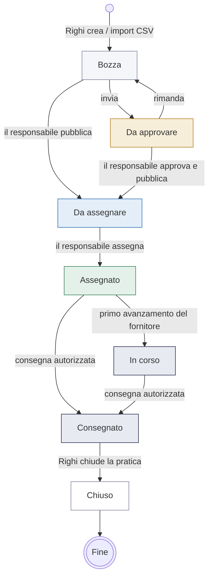

**Etichette in interfaccia**: lo stato interno `pubblicato` è mostrato come
**"Da assegnare"**, perché descrive l'azione attesa da Righi anziché un fatto
tecnico. Lo stesso badge colorato compare in bacheca, in cima alla commessa e
nella guida.

### 3.2 Visibilità delle commesse al fornitore

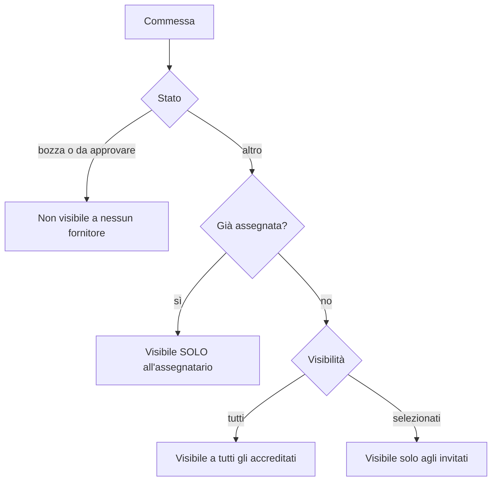

Conseguenza voluta: **appena una commessa è assegnata, sparisce dalla vista degli
altri fornitori**. Nessuno sa a chi è andata né a quanto.

### 3.3 Le tre date e gli alert

Il portale distingue tre date con funzioni diverse. È la distinzione che rende
sensati gli allarmi:

| Data | Significato | Chi la vede | Ruolo |
|---|---|---|---|
| **Inizio lavori stimato** | Quando dovrebbe partire la produzione | Righi + fornitore | Alert *inizio in ritardo* |
| **Rientro in Righi** | Riconsegna del quadro finito | Righi + fornitore | Scadenza operativa: carico, puntualità, ordinamenti |
| **Consegna al cliente** | Impegno di Righi verso il cliente finale | Solo Righi | Margine interno, **mai** usata per gli alert |

Gli alert si basano **solo sulle date operative**:

- **Inizio in ritardo** — commessa `assegnato` con inizio stimato superato
  (produzione non ancora partita).
- **Rientro in ritardo** — commessa `assegnato` o `in_corso` con rientro superato.

Il *semaforo di salute* aggiunge la previsione, incrociando giorni residui,
avanzamento dichiarato e puntualità storica del fornitore:

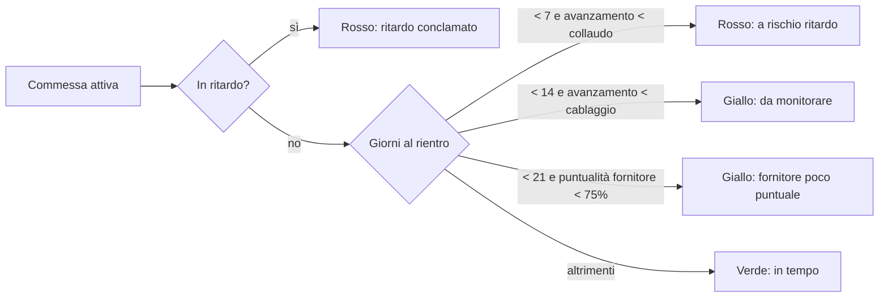

### 3.4 Dalla pubblicazione all'assegnazione

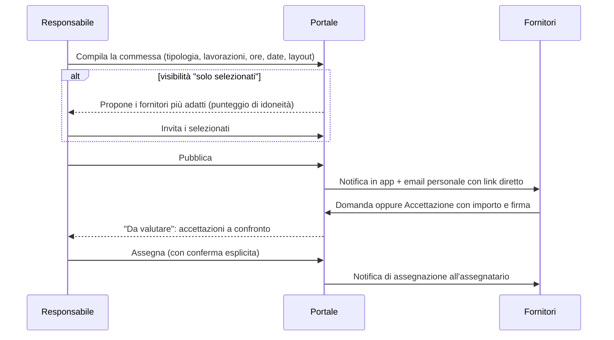

**Suggerimento dei fornitori** — punteggio calcolato, non arbitrario. Concorrono
solo fornitori **accreditati e attivi**:

| Fattore | Peso |
|---|---|
| Preferenza dell'OTL per quel fornitore (% storica) | + metà della percentuale |
| Specializzazione sulla tipologia di quadro | + 35 |
| Esperienza nel settore | + 20 |
| Certificazione >250A su quadri di potenza | + 12 |
| Certificazione igienico/food su food e farmaceutico | + 10 |
| Capacità libera sufficiente nel mese | + 20 (parziale + 8, saturo − 12) |
| Puntualità storica | ± in proporzione allo scarto da 70% |
| **Ingombro non lavorabile** | **− 45** (vincolo quasi bloccante) |

**Firma leggera** — accettando, il fornitore spunta una conferma a proprio nome:
il portale registra nominativo, data e ora. Vale come assunzione di impegno
tracciata; l'irrobustimento (hash, IP, PDF d'ordine) è previsto lato server.

### 3.5 Comunicazione: richieste guidate

Il fornitore non scrive email libere: sceglie un **tipo** e il portale struttura
il resto. Otto tipi disponibili:

| Tipo | Effetto |
|---|---|
| Dubbio tecnico | Conversazione con il caposquadra |
| Mancanza materiale | Idem, con foto allegabile |
| **Richiesta di slittamento** | Se approvata **sposta la data di rientro** con storico |
| Segnalazione ritardo | Segnalazione tracciata |
| Chiarimento layout / sopralluogo | Conversazione |
| **Richiesta di approvazione consegna** | Se approvata **sblocca** il "Segna consegnato" |
| **Richiesta di extra** | Se approvata **aumenta l'importo** della commessa |
| Altro | **Descrizione obbligatoria**: una richiesta generica senza spiegazione non è valutabile |

Il caposquadra risponde con **risposte rapide** predefinite (*Procedi pure*,
*Ti richiamo a breve*, *OK usa l'alternativa*, *Serve un sopralluogo*,
*Verifico e ti aggiorno*) — conversazione senza tastiera.

### 3.6 Gestione degli extra

Il problema che risolve: senza uno strumento, la lavorazione in più si tratta a
voce, l'importo reale diverge da quello registrato e il conto si discute a lavoro
finito, quando Righi ha già il quadro in casa.

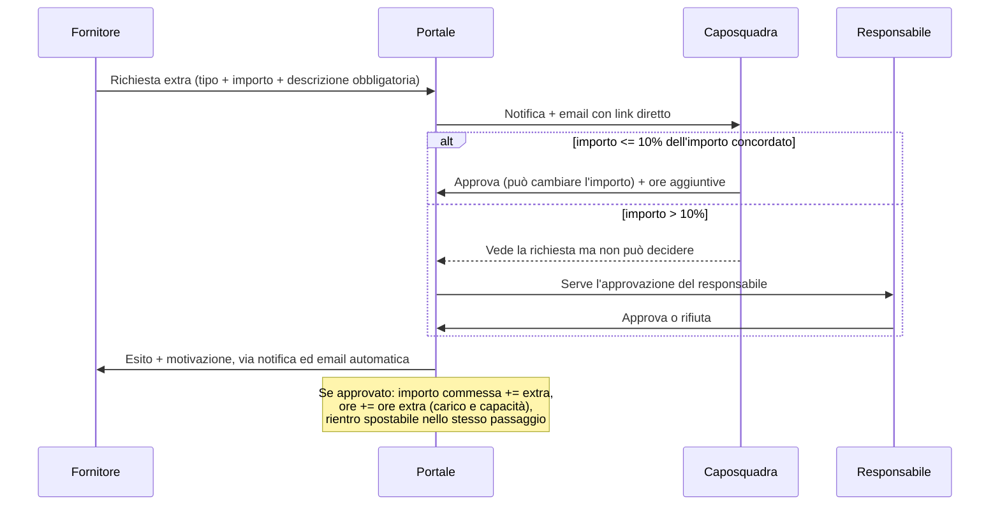

**Regole**

- **Soglia: 10%** dell'importo concordato (costante `EXTRA_SOGLIA_PERC`). Su una
  commessa da 10.000 € il confine è 1.000 €. Il controllo è applicato anche alla
  chiamata diretta, non solo nascondendo i pulsanti.
- **Contro-proposta**: Righi può riconoscere un importo **diverso** da quello
  richiesto. È il caso reale più frequente; senza questa possibilità la funzione
  si ridurrebbe a "tutto o niente".
- **Le ore contano**: le ore aggiuntive (dato interno) entrano in carico,
  capacità mensile e analisi del collo di bottiglia. Ometterle farebbe apparire
  più capacità libera di quanta ce ne sia — la pianificazione si sfaserebbe in
  silenzio.
- **Blocco**: un extra ancora aperto **impedisce l'autorizzazione a consegnare**.
  Le questioni economiche si chiudono prima che il quadro rientri.
- **Effetti a valle**: importo finale = concordato + extra approvati; l'export per
  l'ERP distingue `importo_base`, `extra_approvati`, `importo_finale`.

### 3.7 Qualifica del fornitore: chi può lavorare per noi

Accanto alla domanda operativa *«a chi conviene affidare questo lavoro?»* il
portale presidia quella preliminare: *«questo fornitore **può** lavorare per
noi?»*. È il perimetro tipico dei sistemi di gestione della conformità, ripreso
qui **solo per la parte che incide sull'assegnazione**.

**Non tutti i documenti sono bloccanti.** È la distinzione che regge tutta la
sezione: un DURC scaduto ferma il lavoro, un'informativa privacy non firmata va
sollecitata ma non ferma niente. Confondere le due cose porta o a bloccare
troppo (e allora la regola viene aggirata) o a non bloccare mai (e allora la
regola non esiste). Per questo il registro dei tipi è **configurabile** e la
proprietà «bloccante» è **separata** da «richiesto».

**Il registro dei tipi** (menu *Fornitori · Tipi di documento*, riservato al
responsabile di produzione). Ogni tipo dichiara sette proprietà, e ognuna ha un
effetto osservabile:

| Proprietà | Che cosa cambia davvero |
|---|---|
| **Tipo di documento** | Il nome mostrato a Righi e, se visibile, al fornitore |
| **Caratteristiche** | Riga di dettaglio: norma, ente, contenuto |
| **Richiesto** | Se no, la sua assenza non genera alcuna segnalazione |
| **Bloccante** | Se manca, è scaduto o respinto rende il fornitore **non assegnabile**. Vale solo per i documenti richiesti: facoltativo e bloccante è una regola contraddittoria, e il portale la corregge dichiarandolo |
| **Chi può vederlo** | *Righi e il fornitore*, oppure *solo Righi*: un tipo riservato sparisce dal profilo del fornitore, che non lo vede e non lo può inviare |
| **Avviso di scadenza** | Se spento, il documento resta «in regola» fino al giorno della scadenza: nessun rumore per mesi su un documento che si rinnova da sé |
| **Giorni di anticipo** | Per tipo, non globale: un DURC quadrimestrale e una polizza annuale non si preavvisano allo stesso modo |
| **Validità (mesi)** | Propone la nuova scadenza quando si registra un rinnovo |

Configurazione di partenza:

| Documento | Richiesto | Bloccante | Visibile a | Avviso |
|---|:---:|:---:|---|---|
| DURC — regolarità contributiva | sì | **sì** | fornitore | 30 gg |
| Polizza RCT/RCO | sì | **sì** | fornitore | 45 gg |
| Idoneità tecnico-professionale (art. 26 D.Lgs. 81/08) | sì | **sì** | fornitore | 30 gg |
| Visura camerale | sì | **sì** | fornitore | 30 gg |
| Informativa privacy firmata | sì | no | fornitore | 60 gg |
| Scheda di valutazione fornitore | sì | no | **solo Righi** | nessuno |
| ISO 9001 · ISO 45001 | no | no | fornitore | 60 gg |

**La qualifica non è un campo digitato**: è calcolata dai documenti e dal
registro. Cambiare una riga del registro ricalcola tutti i fornitori nello
stesso istante — per questo il modulo dichiara **quanti cambiano stato prima
di salvare** («8 diventano non assegnabili»), invece di lasciarlo scoprire.

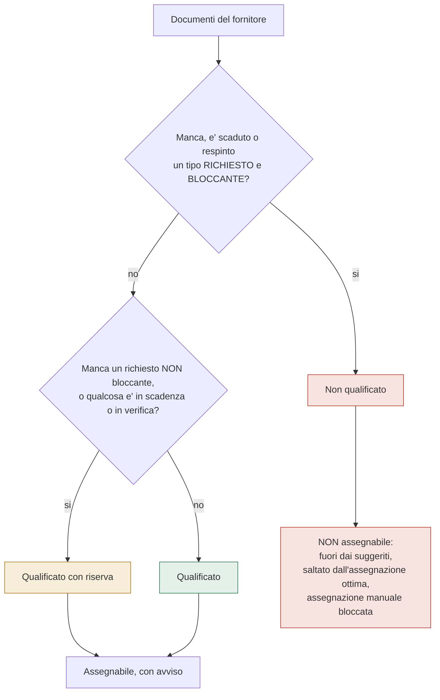

**Disattivare non è eliminare.** Un tipo che non serve più si disattiva: esce
dalla qualifica di tutti, ma i documenti già registrati restano e tornano a
contare se lo si riattiva. L'eliminazione è consentita solo se **nessun
fornitore** ha mai consegnato quel documento — altrimenti si cancellerebbe uno
storico, e il portale lo rifiuta dicendolo.

**Dove agisce** — è ciò che distingue una funzione reale da una scheda
informativa:

1. **Suggerimento fornitori**: i non qualificati non compaiono, e il modulo di
   invito dichiara **quanti** sono esclusi e **perché** (mai una sparizione muta).
2. **Assegnazione manuale**: bloccata, con il motivo esplicito. Il controllo è
   nella funzione, non solo nel nascondere il pulsante.
3. **Assegnazione ottima**: li salta.
4. **Cruscotto**: un indicatore conta i *fornitori non in regola* e porta
   all'elenco già filtrato.
5. **Profilo del fornitore**: vede il proprio stato e cosa gli manca.

**Il ciclo del documento**

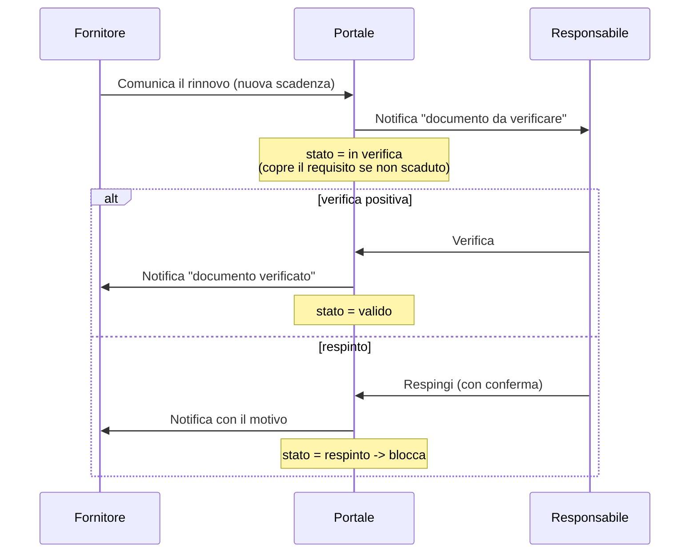

Un documento **in verifica** con scadenza futura **copre** il requisito: è stato
consegnato, manca solo il controllo. Se invece è già scaduto, la scadenza vince.

**Chi fa cosa**: il fornitore vede **solo i propri** documenti, e fra questi
**solo i tipi non riservati**; può comunicare un rinnovo. Il **responsabile**
configura il registro, registra, verifica o respinge; il **caposquadra
consulta** ma non modifica, coerentemente con la regola dell'anagrafica.

**I motivi sono filtrati per chi legge.** Se a bloccare (o a mettere in riserva)
è un documento riservato, il fornitore viene avvisato che *esiste* un documento
gestito da Righi non in regola, ma non ne legge il nome: la sua scheda di
valutazione interna resta interna. Un blocco senza spiegazione sarebbe peggio
del blocco; un blocco che rivela un giudizio interno sarebbe una fuga.

### 3.8 Consegna con autorizzazione

Il fornitore **non chiude da solo**. Quando è pronto chiede l'autorizzazione; solo
dopo l'ok compare *Segna consegnato*.

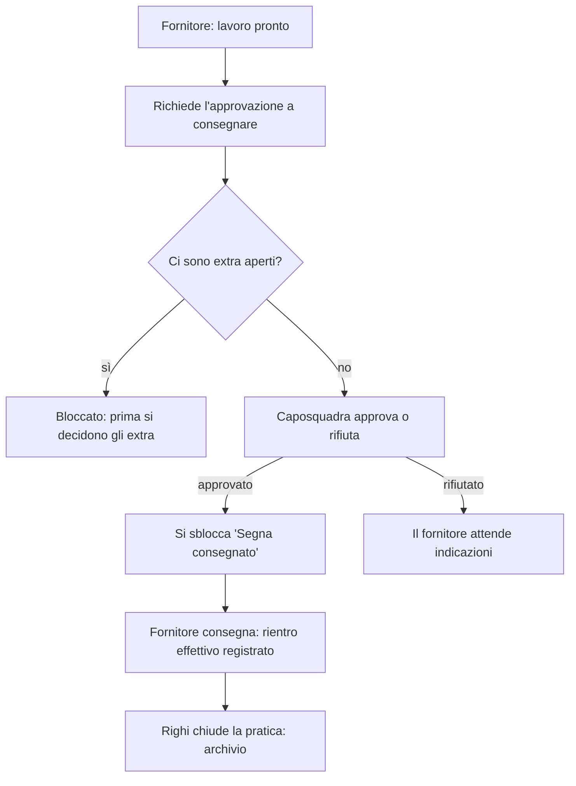

Il **rientro effettivo** registrato alla consegna alimenta la puntualità: è un
dato di fatto, non una valutazione.

### 3.9 Metriche del fornitore

Calcolate dai lavori, **mai inserite a mano**, e **identiche** nelle due viste —
è ciò che le rende condivisibili in una discussione.

| Metrica | Definizione |
|---|---|
| **Puntualità** | % di consegne con rientro effettivo ≤ rientro concordato |
| **Ritardo medio** | Giorni medi di ritardo sulle sole consegne in ritardo |
| **Lavori / mese** | Commesse assegnate ÷ mesi di attività |
| **Tasso di accettazione** | Accettate ÷ invitate |
| **Tempo di risposta** | Giorni medi tra pubblicazione e accettazione |
| **Valore attivo** | Somma degli importi delle commesse in corso |
| **Extra** | % di commesse con extra e scostamento % sul concordato |
| **Carico ore / saturazione** | *Solo Righi* |

### 3.10 Comunicazione verso l'esterno: il magic link

Un fornitore poco pratico del portale non scopre da solo che è arrivata una
risposta. Il portale quindi **spinge**, non aspetta.


- Il link porta **direttamente alla pagina finale** — la commessa da accettare, la
  richiesta a cui rispondere — **senza passare dal login**.
- L'invio a più fornitori è **personalizzato**: un messaggio a testa, con il
  **proprio** link e il **solo** proprio indirizzo. Più riservato di una copia
  nascosta, perché ogni email ha un unico destinatario.
- **Il link identifica, non autorizza**: un codice commessa non è una password.
  Prima di aprire, il portale verifica sempre il diritto di vedere quel contenuto.
- L'identità viene **ripulita dall'URL** subito dopo l'accesso.

### 3.11 Il linguaggio sonoro

Chi usa il portale tutto il giorno non guarda lo schermo a ogni clic: lo tiene
aperto mentre parla al telefono, mentre cammina in reparto, mentre compila
altro. Il suono è il canale che conferma **senza chiedere attenzione**. Per
questo non è un abbellimento aggiunto alla fine, ma un linguaggio con una
grammatica: chi lo ha sentito tre volte lo capisce senza che nessuno glielo
spieghi.

**Le regole della famiglia**

| Regola | Perché |
|---|---|
| **Una sola voce** — sinusoide con la sua ottava di rinforzo, attacco di 6 ms, coda esponenziale | Cambia la melodia, non il timbro: tutti i suoni si riconoscono come "del portale" |
| **Una sola scala** — pentatonica di DO (DO RE MI SOL LA) | Due note qualsiasi di questa scala non stonano: anche due suoni sovrapposti restano gradevoli |
| **La direzione è il significato** — sale / scende | Si impara senza manuale: sale = è andato avanti, scende = è stato negato |
| **La durata è il peso** — 90 ms per un tocco, 250-350 ms per una conferma | Un suono lungo su un'azione minore stanca già al terzo ascolto |
| **Un solo eroe** — solo l'assegnazione ha la coda lunga (~0,7 s) | Se tutto è importante, niente è importante |
| **Volumi bassi** — nessuna voce oltre 0,20 sul bus | Si lavora in ufficio e in officina: il suono conferma, non annuncia |

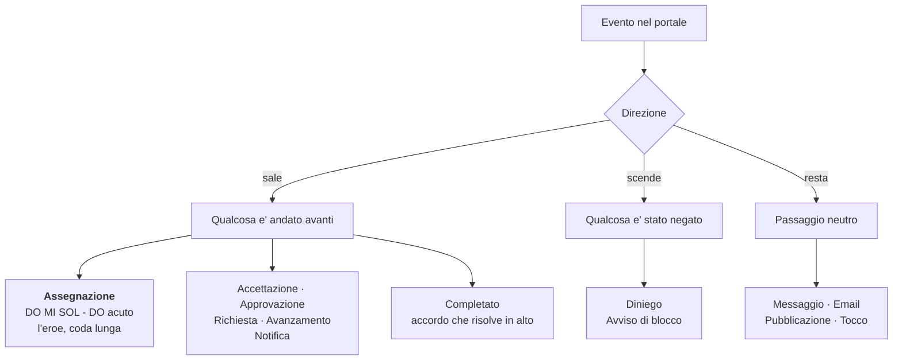

**Il repertorio**

| Suono | Quando si sente | Forma |
|---|---|---|
| **Assegnazione** | Una commessa viene affidata a un fornitore (singola o in blocco) | DO MI SOL che risolve sul DO acuto, con un velo d'aria sotto |
| **Accettazione** | Il fornitore accetta e firma la proposta | Due note aperte, ascendenti |
| **Approvazione** | Commessa approvata, slittamento o extra approvato, consegna autorizzata, documento verificato | Quinta breve che sale all'ottava |
| **Diniego** | Commessa rimandata al caposquadra, slittamento o extra rifiutato, documento respinto | La stessa quinta, discendente e più opaca |
| **Pubblicazione** | Una commessa esce verso i fornitori (pubblicazione o notifica) | Soffio d'aria in salita e una nota che si stacca |
| **Richiesta** | Il fornitore chiede qualcosa a Righi (richiesta guidata, approvazione consegna, documento) | Salita ampia, tono interrogativo |
| **Avanzamento** | Il fornitore aggiorna la lavorazione | Due note vicine, come un passo |
| **Messaggio** | Risposta rapida o domanda inviata | Una sola nota alta e corta |
| **Notifica** | Si apre la campanella con avvisi non letti | Campanello acuto in salita |
| **Email** | L'avviso viene consegnato al programma di posta | Soffio breve e nota alta |
| **Completato** | Commessa consegnata, pratica chiusa | Accordo grave che risolve in alto |
| **Tocco** | Cambi di stato leggeri (date, documenti, presa in carico) | Nota singola brevissima, volume minimo |
| **Avviso** | Qualsiasi azione bloccata | Discesa morbida, mai allarmante |

**Come sono fatti e come si governano**

- **Sintetizzati con Web Audio, nessun file audio**: il portale resta un unico
  file autosufficiente e non scarica nulla. Un suono costa zero byte.
- **L'avviso lo suona il messaggio in basso**: ogni azione bloccata avvisa allo
  stesso modo, senza dover ricordare una chiamata in ogni punto del codice. Se
  l'azione ha già suonato il proprio esito (per esempio un diniego), non si
  raddoppia.
- **Anti-raffica**: lo stesso suono non si somma a sé stesso entro 90 ms, così un
  doppio clic non produce un rimbombo.
- **Interruttore in barra**: l'altoparlante in alto spegne e riaccende tutto; la
  scelta è memorizzata sul dispositivo. Il contesto audio nasce al primo clic —
  prima non esiste, e nulla suona al caricamento o navigando fra le schede.
- **Ambienti senza audio** (browser vecchi, test in Node): il portale funziona
  identico, i suoni semplicemente non partono.

---

## 4. Specifiche tecniche

### 4.1 Architettura

Applicazione **a file unico**: nessuna dipendenza esterna, nessun font o immagine
remota, nessun processo di build necessario per l'esecuzione.

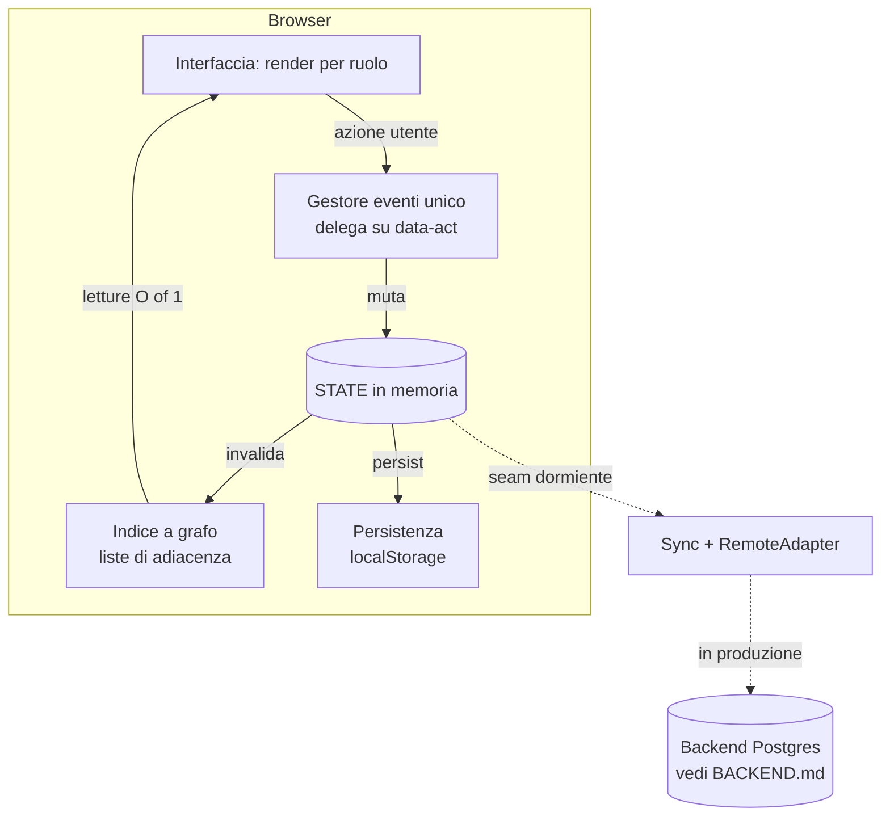

**Scelte strutturali**

- **Un solo gestore di eventi** in delega: ogni elemento interattivo dichiara
  `data-act`, un unico `switch` instrada. Verificabile automaticamente che non
  esistano pulsanti privi di effetto né gestori senza pulsante.
- **Render integrale per ruolo**: `render()` ricostruisce la vista dallo stato;
  non esiste stato dell'interfaccia separato da quello dei dati.
- **Nessuna emoji**: icone SVG in linea (mappa `IC`), per resa uniforme e stampa.
- **Suoni sintetizzati, non registrati**: il modulo `Sfx` genera le note con Web
  Audio (vedi §3.11); nessun file audio da scaricare, il file resta uno solo.
- **Offline-first**: PWA con service worker; i dati restano sul dispositivo.

### 4.2 Modello dati

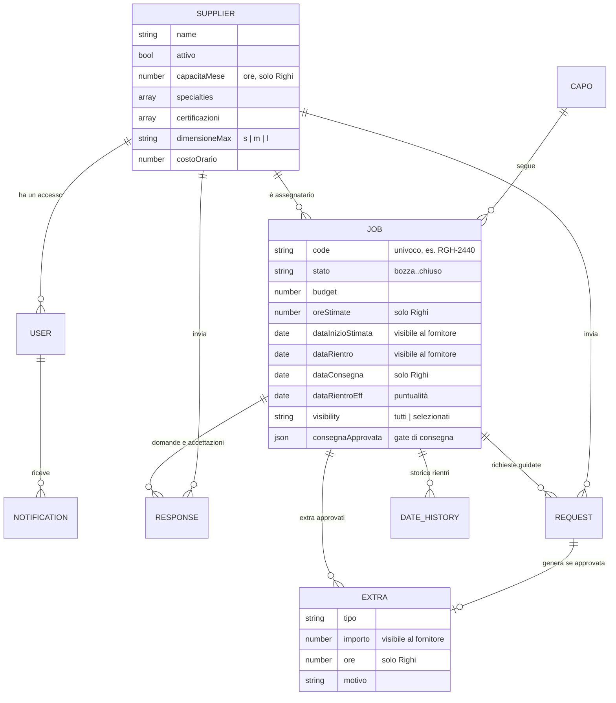

**Regole di derivazione** (calcolate, mai memorizzate due volte):

```
importo_base    = importo accettato, altrimenti budget
importo_finale  = importo_base + somma(extra approvati)
ore_totali      = ore_stimate + somma(ore degli extra)
soglia_extra    = 10% di importo_base
carico(mese)    = somma ore_totali delle commesse attive con rientro in quel mese
capacità_libera = capacità_mensile − carico(mese)
```

### 4.3 Ottimizzazione: il portale come grafo

Lo stato è naturalmente un grafo (fornitori, commesse, richieste, inviti). Tre
applicazioni concrete:

**a) Indice ad adiacenze — prestazioni.** Ricostruito una volta per versione dello
stato, con memoizzazione delle metriche. Il render, prima quadratico (ogni riga
riscandiva tutte le commesse), è ora lineare: a 1000 commesse **circa 10 volte più
veloce** (73 ms → 7 ms), a parità di risultati verificata da test di invarianza.

**b) Assegnazione ottima — matching di peso massimo.**

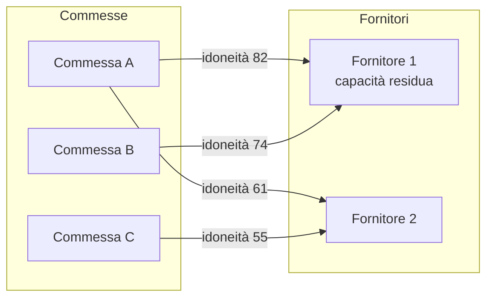

Considera **solo chi ha accettato**, rispetta le **ore libere per fornitore e
mese**, e propone l'allocazione complessiva (idoneità totale e commesse non
collocabili) che Righi conferma. Invarianti verificate a test: nessuna commessa
assegnata due volte, nessun fornitore oltre capacità.

**c) Collo di bottiglia — flusso massimo e taglio minimo.** Per ogni mese di
rientro si costruisce una rete *sorgente → commesse → fornitori → pozzo*: il
flusso massimo dice quante ore sono collocabili, il **taglio minimo** indica
**quali fornitori sono il vincolo**, distinguendo il caso "manca capacità" dal
caso "manca lo spazio o l'accettazione".

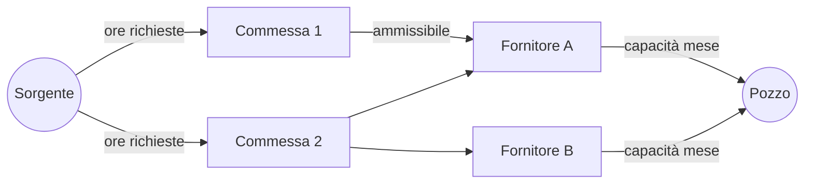

### 4.4 Persistenza e versione dei dati

I dati vivono nello storage del dispositivo. Poiché il codice si aggiorna mentre i
dati salvati restano, ogni salvataggio porta la **versione del modello**
(`DATA_VERSION`): se non coincide con quella dell'applicazione, i dati vengono
**rigenerati**. Senza questo controllo un dispositivo già usato continuerebbe a
mostrare il modello vecchio con il codice nuovo — sembrando "una versione
vecchia". È disponibile anche un **ripristino manuale** dei dati dimostrativi.

### 4.5 Sicurezza

| Aspetto | Nel prototipo | In produzione (`BACKEND.md`) |
|---|---|---|
| Identificazione dal link | Hash non firmato, valido sul dispositivo | **Token firmato e a scadenza**, verificato dal server |
| Autorizzazione | Verifica dei permessi prima di aprire il contenuto | **Stesse regole applicate lato server (RLS)** |
| Riservatezza tra fornitori | Filtri di visibilità + un destinatario per email | Row Level Security per `supplier_id` |
| Soglia di approvazione degli extra | Applicata anche alla chiamata diretta | **Da imporre lato server**: decide di denaro |

> Principio guida: il client applica i controlli per dare un'esperienza corretta,
> ma in produzione **ogni regola che protegge dati o denaro va riapplicata sul
> server**. I controlli lato browser sono un aiuto all'utente, non una difesa.

### 4.6 Qualità: come si verifica che funzioni

| Livello | Copertura |
|---|---|
| **Test di modello** (85) | Date e alert, metriche, capacità, qualifica, matching ottimo, flusso massimo e taglio minimo, invarianti del grafo |
| **Test di sincronizzazione** (6) | Contratto del seam remoto (pull/push, versioni) |
| **Test dei suoni** (26) | La sintesi viene registrata voce per voce: scala, timbro, durate, volumi, direzione melodica, firma distinta per ogni funzionalità, interruttore e anti-raffica |
| **Audit automatici** (3 passate) | Percorso completo di tutti i ruoli su ogni schermata (desktop e mobile), riservatezza, invarianti, persistenza, coerenza dei numeri, casi limite dei link |
| **Prove end-to-end** (33 scenari) | Ciclo di vita, extra, magic link, richieste con foto, approvazioni, carico, analisi, suoni sulle azioni reali, registro dei tipi di documento |
| **Controlli strutturali** | Nessuna funzione vuota, nessun pulsante privo di effetto, nessun gestore orfano, nessuna emoji |

Gli audit hanno individuato e fatto correggere difetti reali — tra cui una **fuga
di riservatezza** (un fornitore poteva aprire con il link la commessa di un altro
conoscendone il codice) e due stati del ciclo di vita **irraggiungibili**. Le
segnalazioni rivelatesi errate sono state verificate una per una e i test difettosi
corretti, per non lasciare falsi allarmi.

### 4.7 Distribuzione

| Forma | Uso | Nota |
|---|---|---|
| `index.html` | Sviluppo e installazione come sito/PWA | Sorgente unico di verità |
| `Portale_Fornitori_Righi.html` | Prova offline su qualsiasi PC | File autosufficiente: **è una fotografia**, va rigenerato a ogni modifica |
| Versione online (artifact) | Condivisione e prova dei link | Unica forma in cui i magic link sono realmente cliccabili |

---

## 5. Evoluzione

**Già realizzato**: richieste con foto, risposte rapide, avviso automatico via
email con link diretto, auto-matching, duplicazione come modello, firma leggera,
assegnazione ottima, lettura del collo di bottiglia, gestione degli extra,
qualifica dei fornitori dai documenti con registro dei tipi configurabile,
linguaggio sonoro degli eventi.

**Prossimi passi** (richiedono il server, dettagliati in `BACKEND.md`):

1. **Invio realmente automatico** delle email, con token firmato per destinatario.
2. **Notifiche push e WhatsApp** con opt-in: l'avviso dove il fornitore già lavora.
3. **Risposta dall'email** con parsing in ingresso: anche chi risponde alla mail
   invece di cliccare rientra nel thread del portale.
4. **Countdown di assegnazione** e **riassegnazione assistita** in caso di rinuncia.
5. **Integrazione ERP e layout di progettazione** per quotare sul dato reale.

---

## 6. Glossario

| Termine | Significato |
|---|---|
| **Commessa** | Singolo lavoro affidato a un fornitore (un quadro o una batteria) |
| **OTL / Caposquadra** | Referente tecnico Righi che segue la commessa |
| **Rientro** | Riconsegna del quadro finito a Righi: la scadenza che conta per il fornitore |
| **Extra** | Lavorazione in più rispetto a quanto concordato all'accettazione |
| **Magic link** | Collegamento nell'email che apre il portale già identificati sulla pagina giusta |
| **Ingombro** | Dimensione massima del quadro che il fornitore può lavorare e movimentare |
| **Saturazione** | Rapporto tra ore assegnate e capacità mensile del fornitore |
| **Gate di consegna** | Vincolo per cui il fornitore non può consegnare senza autorizzazione |
| **Qualifica** | Stato calcolato dai documenti e dal registro dei tipi: abilita, mette in riserva o blocca l'assegnazione |
| **Tipo bloccante** | Documento richiesto la cui assenza o scadenza rende il fornitore non assegnabile |
| **Con riserva** | Qualificato ma con qualcosa da sistemare: non ferma il lavoro |
| **Firma sonora** | Sequenza di note che identifica un evento: distinta per ogni funzionalità |
